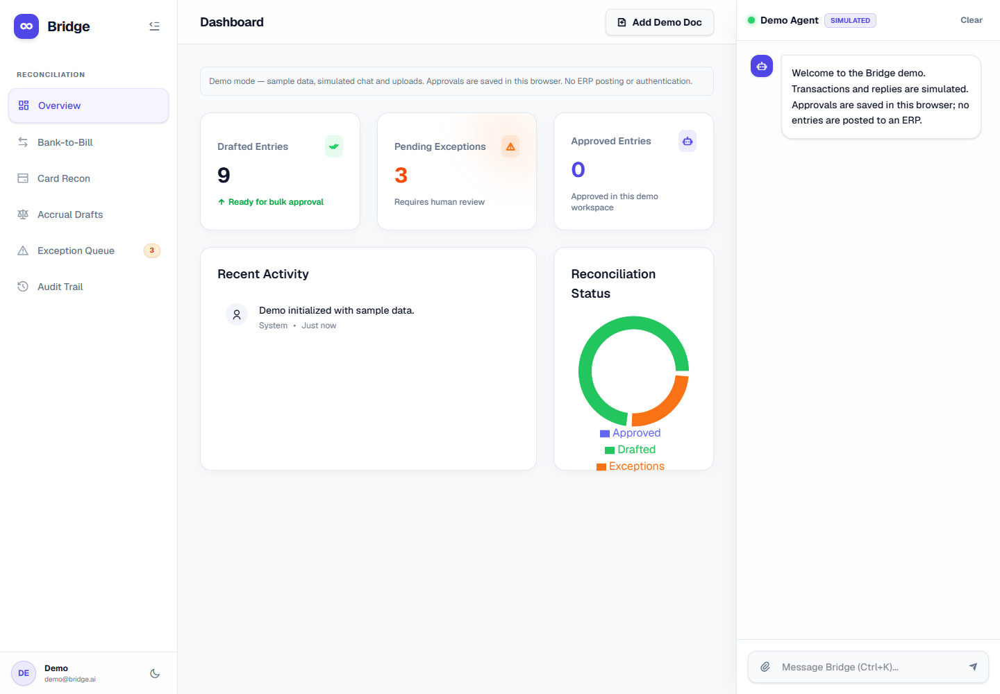
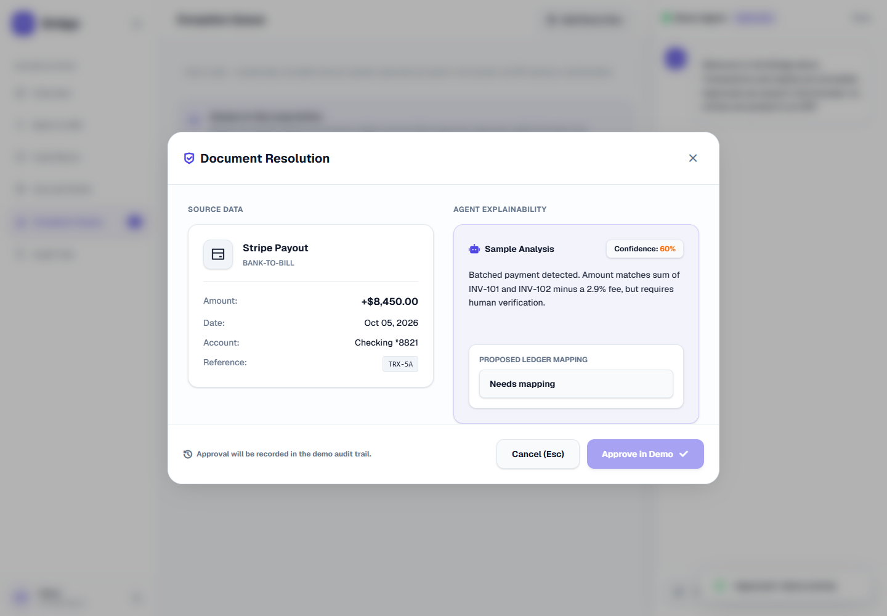
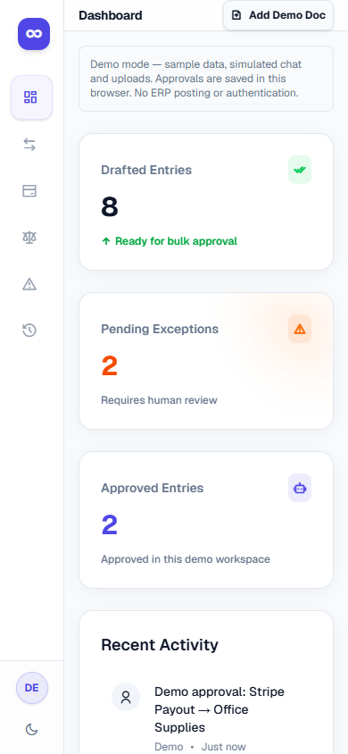
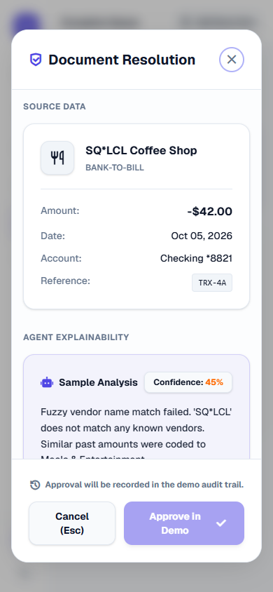

# Frontend screenshots

These screenshots show the Bridge demo with sample transactions. Approvals update demo data stored in the browser; no entries are posted to an ERP.

Validated with the production build in Edge at desktop (1440 × 1000) and mobile (390 × 844) viewport sizes. The review dialog is centered at both sizes; its content scrolls on small screens.

## Desktop dashboard

## Desktop transaction review

## Mobile dashboard

## Mobile transaction review

## Validation

- Production build and strict TypeScript checks passed.
- Lint passed with warnings treated as errors.
- Five ledger regression tests passed.
- Browser checks passed for centered dialogs, visible-row approvals, chosen account mappings, Enter/Cancel/Escape behavior, focus restoration, saved approvals after refresh, mobile viewport fit, and unavailable browser storage.
